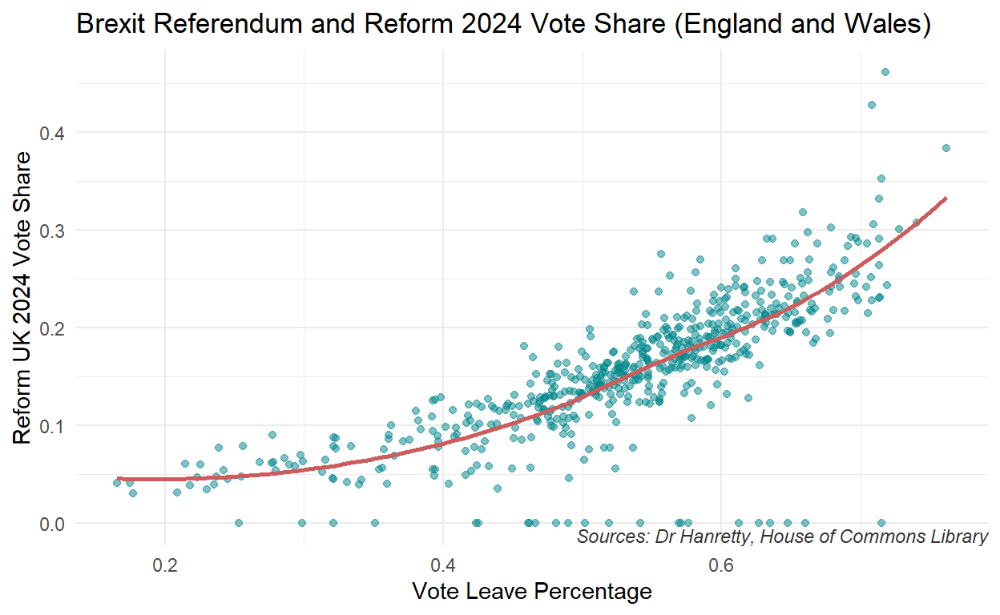

## Project thoughts

Milestone 1: I am interested in doing my final project on either US or European politics. In particular, I am interested in doing a project on electoral politics results over time and determining if any trends arise from the data.

Milestone 2: Is there a relationship between how people voted in the 2016 Brexit Referendum in the UK and the 2024 UK general election? Constituencies that had a higher vote share for Leave in the Brexit Referendum had a higher vote share for the Reform UK party in the 2024 general election. Reform UK (formally the Brexit Party) ran on a platform of limiting immigration and removing Britain from certain European institutions which would appeal to areas that voted to leave the EU while discouraging people that voted "Remain" from voting for them as it would go against their preferences stay more allinged with the EU. The explanatory variable is each of the UK's constituencies. The outcome variable is the vote share for Leave in the Brexit Referendum and the vote share for Reform UK in each constituency. The hypothesis would be supported if there is a positive correlation between the vote share of Leave in the Brexit Referendum and the vote share of Reform UK in the 2024 general election.

## Milestone 3

<div class="layout-chunk" data-layout="l-body">
<div class="sourceCode"><pre class="sourceCode r"><code class="sourceCode r"><span><span class='kw'><a href='https://rdrr.io/r/base/library.html'>library</a></span><span class='op'>(</span><span class='va'><a href='https://tidyverse.tidyverse.org'>tidyverse</a></span><span class='op'>)</span></span>
<span><span class='kw'><a href='https://rdrr.io/r/base/library.html'>library</a></span><span class='op'>(</span><span class='va'><a href='https://github.com/tidymodels/infer'>infer</a></span><span class='op'>)</span></span>
<span><span class='kw'><a href='https://rdrr.io/r/base/library.html'>library</a></span><span class='op'>(</span><span class='va'><a href='https://broom.tidymodels.org/'>broom</a></span><span class='op'>)</span></span>
<span></span>
<span><span class='va'>X2024_Brexit_Results</span> <span class='op'>&lt;-</span> <span class='fu'><a href='https://readr.tidyverse.org/reference/read_delim.html'>read_csv</a></span><span class='op'>(</span><span class='st'>"data/2024_Brexit_Results.csv"</span><span class='op'>)</span></span>
<span></span>
<span><span class='va'>HoC_GE2024_results_by_constituency</span> <span class='op'>&lt;-</span> <span class='fu'><a href='https://readr.tidyverse.org/reference/read_delim.html'>read_csv</a></span><span class='op'>(</span><span class='st'>"data/HoC-GE2024-results-by-constituency.csv"</span><span class='op'>)</span></span>
<span></span>
<span><span class='va'>UK_election_results</span> <span class='op'>&lt;-</span> <span class='va'>HoC_GE2024_results_by_constituency</span></span>
<span></span>
<span><span class='va'>UK_election_results</span></span></code></pre></div>

```
# A tibble: 650 × 32
   `ONS ID`  `ONS region ID` `Constituency name`         `County name`
   <chr>     <chr>           <chr>                       <lgl>        
 1 W07000081 W92000004       Aberafan Maesteg            NA           
 2 S14000060 S92000003       Aberdeen North              NA           
 3 S14000061 S92000003       Aberdeen South              NA           
 4 S14000062 S92000003       Aberdeenshire North and Mo… NA           
 5 S14000063 S92000003       Airdrie and Shotts          NA           
 6 E14001063 E12000008       Aldershot                   NA           
 7 E14001064 E12000005       Aldridge-Brownhills         NA           
 8 S14000064 S92000003       Alloa and Grangemouth       NA           
 9 E14001065 E12000002       Altrincham and Sale West    NA           
10 W07000082 W92000004       Alyn and Deeside            NA           
# ℹ 640 more rows
# ℹ 28 more variables: `Region name` <chr>, `Country name` <chr>,
#   `Constituency type` <chr>, `Declaration time` <lgl>,
#   `Member first name` <chr>, `Member surname` <chr>,
#   `Member gender` <chr>, Result <chr>, `First party` <chr>,
#   `Second party` <chr>, Electorate <dbl>, `Valid votes` <dbl>,
#   `Invalid votes` <dbl>, Majority <dbl>, Con <dbl>, Lab <dbl>, …
```

<div class="sourceCode"><pre class="sourceCode r"><code class="sourceCode r"><span><span class='va'>Brexit_2024_results</span> <span class='op'>&lt;-</span> <span class='va'>X2024_Brexit_Results</span></span>
<span></span>
<span></span>
<span></span>
<span><span class='va'>UK_election_results_2019</span> <span class='op'>&lt;-</span> <span class='fu'><a href='https://rdrr.io/r/utils/read.table.html'>read.csv</a></span><span class='op'>(</span><span class='st'>"data/2019 UK Election Results.csv"</span><span class='op'>)</span></span></code></pre></div>

</div>


## 2019 Conservative Party and Vote Leave Plot

<div class="layout-chunk" data-layout="l-body">
<div class="sourceCode"><pre class="sourceCode r"><code class="sourceCode r"><span><span class='va'>England_results_2019</span> <span class='op'>&lt;-</span> <span class='va'>UK_election_results_2019</span> <span class='op'>|&gt;</span></span>
<span>  <span class='fu'><a href='https://dplyr.tidyverse.org/reference/filter.html'>filter</a></span><span class='op'>(</span><span class='va'>country_name</span> <span class='op'>==</span> <span class='st'>"England"</span><span class='op'>)</span></span>
<span></span>
<span><span class='va'>England_results_2019</span> <span class='op'>&lt;-</span> <span class='va'>England_results_2019</span> <span class='op'>|&gt;</span> </span>
<span>  <span class='fu'><a href='https://dplyr.tidyverse.org/reference/rename.html'>rename</a></span><span class='op'>(</span>Constituen <span class='op'>=</span> <span class='va'>Boundary.Comm.name</span><span class='op'>)</span></span>
<span></span>
<span><span class='va'>England_results_2019</span> <span class='op'>&lt;-</span> <span class='va'>England_results_2019</span> <span class='op'>|&gt;</span></span>
<span>  <span class='fu'><a href='https://dplyr.tidyverse.org/reference/mutate-joins.html'>left_join</a></span><span class='op'>(</span><span class='va'>Brexit_2024_results</span><span class='op'>)</span></span>
<span></span>
<span><span class='va'>England_results_2019</span> <span class='op'>|&gt;</span></span>
<span>   <span class='fu'><a href='https://dplyr.tidyverse.org/reference/filter.html'>filter</a></span><span class='op'>(</span><span class='va'>CON.</span> <span class='op'>&gt;</span> <span class='fl'>0</span><span class='op'>)</span> <span class='op'>|&gt;</span></span>
<span><span class='fu'><a href='https://ggplot2.tidyverse.org/reference/ggplot.html'>ggplot</a></span><span class='op'>(</span>data <span class='op'>=</span> <span class='va'>England_results_2019</span>, mapping <span class='op'>=</span> <span class='fu'><a href='https://ggplot2.tidyverse.org/reference/aes.html'>aes</a></span><span class='op'>(</span>x <span class='op'>=</span> <span class='va'>LeavePct</span>, y <span class='op'>=</span> <span class='va'>CON.</span><span class='op'>)</span><span class='op'>)</span> <span class='op'>+</span></span>
<span>  <span class='fu'><a href='https://ggplot2.tidyverse.org/reference/geom_point.html'>geom_point</a></span><span class='op'>(</span>color <span class='op'>=</span> <span class='st'>"turquoise4"</span>, alpha <span class='op'>=</span> <span class='fl'>.5</span><span class='op'>)</span> <span class='op'>+</span></span>
<span>  <span class='fu'><a href='https://ggplot2.tidyverse.org/reference/geom_smooth.html'>geom_smooth</a></span><span class='op'>(</span>color <span class='op'>=</span> <span class='st'>"indianred"</span>, se <span class='op'>=</span> <span class='cn'>FALSE</span><span class='op'>)</span> <span class='op'>+</span></span>
<span>  <span class='fu'><a href='https://ggplot2.tidyverse.org/reference/labs.html'>labs</a></span><span class='op'>(</span></span>
<span>    x <span class='op'>=</span> <span class='st'>"Vote Leave Percentage"</span>,</span>
<span>    y <span class='op'>=</span> <span class='st'>"Conservative Party 2019 Vote Share"</span>,</span>
<span>  title <span class='op'>=</span> <span class='st'>"Brexit Referendum and Conservative Party 2019 Vote Share England"</span></span>
<span>  <span class='op'>)</span> <span class='op'>+</span></span>
<span>   <span class='fu'><a href='https://ggplot2.tidyverse.org/reference/annotate.html'>annotate</a></span><span class='op'>(</span></span>
<span>    <span class='st'>"text"</span>, </span>
<span>    x <span class='op'>=</span> <span class='cn'>Inf</span>, y <span class='op'>=</span> <span class='op'>-</span><span class='cn'>Inf</span>, </span>
<span>    label <span class='op'>=</span> <span class='st'>"Sources: Dr Henretty, House of Commons Library"</span>, </span>
<span>    hjust <span class='op'>=</span> <span class='fl'>1</span>, vjust <span class='op'>=</span> <span class='op'>-</span><span class='fl'>.25</span>, </span>
<span>    size <span class='op'>=</span> <span class='fl'>3</span>, color <span class='op'>=</span> <span class='st'>"gray20"</span>, fontface <span class='op'>=</span> <span class='st'>"italic"</span></span>
<span>  <span class='op'>)</span> <span class='op'>+</span></span>
<span>  <span class='fu'><a href='https://ggplot2.tidyverse.org/reference/ggtheme.html'>theme_minimal</a></span><span class='op'>(</span><span class='op'>)</span></span></code></pre></div>


</div>


## 2024 Conservative Vote Share and Vote Leave Plot

<div class="layout-chunk" data-layout="l-body">
<div class="sourceCode"><pre class="sourceCode r"><code class="sourceCode r"><span><span class='va'>England_results</span> <span class='op'>&lt;-</span> <span class='va'>UK_election_results</span> <span class='op'>|&gt;</span></span>
<span>  <span class='fu'><a href='https://dplyr.tidyverse.org/reference/filter.html'>filter</a></span><span class='op'>(</span><span class='va'>`Country name`</span> <span class='op'>==</span> <span class='st'>"England"</span><span class='op'>)</span></span>
<span></span>
<span><span class='va'>England_results</span> <span class='op'>&lt;-</span> <span class='va'>England_results</span> <span class='op'>|&gt;</span></span>
<span>  <span class='fu'><a href='https://dplyr.tidyverse.org/reference/rename.html'>rename</a></span><span class='op'>(</span>Constituen <span class='op'>=</span> <span class='va'>`Constituency name`</span><span class='op'>)</span></span>
<span></span>
<span><span class='va'>England_results</span> <span class='op'>&lt;-</span> <span class='va'>England_results</span> <span class='op'>|&gt;</span></span>
<span>  <span class='fu'><a href='https://dplyr.tidyverse.org/reference/mutate-joins.html'>left_join</a></span><span class='op'>(</span><span class='va'>Brexit_2024_results</span><span class='op'>)</span></span>
<span></span>
<span><span class='va'>England_results</span> <span class='op'>&lt;-</span> <span class='va'>England_results</span> <span class='op'>|&gt;</span></span>
<span>  <span class='fu'><a href='https://dplyr.tidyverse.org/reference/mutate.html'>mutate</a></span><span class='op'>(</span></span>
<span>    Con_share <span class='op'>=</span> <span class='va'>Con</span> <span class='op'>/</span> <span class='va'>`Valid votes`</span>,</span>
<span>Reform_share <span class='op'>=</span> <span class='va'>RUK</span> <span class='op'>/</span> <span class='va'>`Valid votes`</span>,</span>
<span>LD_share <span class='op'>=</span> <span class='va'>LD</span> <span class='op'>/</span> <span class='va'>`Valid votes`</span></span>
<span><span class='op'>)</span></span>
<span>         </span>
<span></span>
<span></span>
<span><span class='va'>England_results</span> <span class='op'>|&gt;</span></span>
<span>  <span class='fu'><a href='https://dplyr.tidyverse.org/reference/filter.html'>filter</a></span><span class='op'>(</span><span class='va'>Reform_share</span> <span class='op'>&gt;</span> <span class='fl'>0</span><span class='op'>)</span> <span class='op'>|&gt;</span></span>
<span><span class='fu'><a href='https://ggplot2.tidyverse.org/reference/ggplot.html'>ggplot</a></span><span class='op'>(</span>data <span class='op'>=</span> <span class='va'>England_results</span>, mapping <span class='op'>=</span> <span class='fu'><a href='https://ggplot2.tidyverse.org/reference/aes.html'>aes</a></span><span class='op'>(</span>x <span class='op'>=</span> <span class='va'>LeavePct</span>, y <span class='op'>=</span> <span class='va'>Con_share</span><span class='op'>)</span><span class='op'>)</span> <span class='op'>+</span></span>
<span>  <span class='fu'><a href='https://ggplot2.tidyverse.org/reference/geom_point.html'>geom_point</a></span><span class='op'>(</span>color <span class='op'>=</span> <span class='st'>"turquoise4"</span>, alpha <span class='op'>=</span> <span class='fl'>.5</span><span class='op'>)</span> <span class='op'>+</span></span>
<span>  <span class='fu'><a href='https://ggplot2.tidyverse.org/reference/geom_smooth.html'>geom_smooth</a></span><span class='op'>(</span>color <span class='op'>=</span> <span class='st'>"indianred"</span>, se <span class='op'>=</span> <span class='cn'>FALSE</span><span class='op'>)</span> <span class='op'>+</span></span>
<span>  <span class='fu'><a href='https://ggplot2.tidyverse.org/reference/labs.html'>labs</a></span><span class='op'>(</span></span>
<span>    x <span class='op'>=</span> <span class='st'>"Vote Leave Percentage"</span>,</span>
<span>    y <span class='op'>=</span> <span class='st'>"Conservative Party 2024 Vote Share"</span>,</span>
<span>  title <span class='op'>=</span> <span class='st'>"Brexit Referendum and 2024 Conservative Party Vote Share England"</span></span>
<span>  <span class='op'>)</span> <span class='op'>+</span></span>
<span>   <span class='fu'><a href='https://ggplot2.tidyverse.org/reference/annotate.html'>annotate</a></span><span class='op'>(</span></span>
<span>    <span class='st'>"text"</span>, </span>
<span>    x <span class='op'>=</span> <span class='cn'>Inf</span>, y <span class='op'>=</span> <span class='op'>-</span><span class='cn'>Inf</span>, </span>
<span>    label <span class='op'>=</span> <span class='st'>"Sources: Dr Henretty, House of Commons Library"</span>, </span>
<span>    hjust <span class='op'>=</span> <span class='fl'>1</span>, vjust <span class='op'>=</span> <span class='op'>-</span><span class='fl'>.25</span>, </span>
<span>    size <span class='op'>=</span> <span class='fl'>3</span>, color <span class='op'>=</span> <span class='st'>"gray20"</span>, fontface <span class='op'>=</span> <span class='st'>"italic"</span></span>
<span>  <span class='op'>)</span> <span class='op'>+</span></span>
<span>  <span class='fu'><a href='https://ggplot2.tidyverse.org/reference/ggtheme.html'>theme_minimal</a></span><span class='op'>(</span><span class='op'>)</span></span></code></pre></div>


</div>


## 2019 Brexit Party Vote Share and Vote Leave Plot

<div class="layout-chunk" data-layout="l-body">
<div class="sourceCode"><pre class="sourceCode r"><code class="sourceCode r"><span><span class='va'>England_results_2019</span> <span class='op'>|&gt;</span></span>
<span>   <span class='fu'><a href='https://dplyr.tidyverse.org/reference/filter.html'>filter</a></span><span class='op'>(</span><span class='va'>BRX.</span> <span class='op'>&gt;</span> <span class='fl'>0</span><span class='op'>)</span> <span class='op'>|&gt;</span></span>
<span><span class='fu'><a href='https://ggplot2.tidyverse.org/reference/ggplot.html'>ggplot</a></span><span class='op'>(</span>data <span class='op'>=</span> <span class='va'>England_results_2019</span>, mapping <span class='op'>=</span> <span class='fu'><a href='https://ggplot2.tidyverse.org/reference/aes.html'>aes</a></span><span class='op'>(</span>x <span class='op'>=</span> <span class='va'>LeavePct</span>, y <span class='op'>=</span> <span class='va'>BRX.</span><span class='op'>)</span><span class='op'>)</span> <span class='op'>+</span></span>
<span>  <span class='fu'><a href='https://ggplot2.tidyverse.org/reference/geom_point.html'>geom_point</a></span><span class='op'>(</span>color <span class='op'>=</span> <span class='st'>"turquoise4"</span>, alpha <span class='op'>=</span> <span class='fl'>.5</span><span class='op'>)</span> <span class='op'>+</span></span>
<span>  <span class='fu'><a href='https://ggplot2.tidyverse.org/reference/geom_smooth.html'>geom_smooth</a></span><span class='op'>(</span>color <span class='op'>=</span> <span class='st'>"indianred"</span>, se <span class='op'>=</span> <span class='cn'>FALSE</span><span class='op'>)</span> <span class='op'>+</span></span>
<span>  <span class='fu'><a href='https://ggplot2.tidyverse.org/reference/labs.html'>labs</a></span><span class='op'>(</span></span>
<span>    x <span class='op'>=</span> <span class='st'>"Vote Leave Percentage"</span>,</span>
<span>    y <span class='op'>=</span> <span class='st'>"Brexit Party 2019 Vote Share"</span>,</span>
<span>  title <span class='op'>=</span> <span class='st'>"Brexit Referendum and Brexit Party 2019 Vote Share England"</span></span>
<span>  <span class='op'>)</span> <span class='op'>+</span></span>
<span>   <span class='fu'><a href='https://ggplot2.tidyverse.org/reference/annotate.html'>annotate</a></span><span class='op'>(</span></span>
<span>    <span class='st'>"text"</span>, </span>
<span>    x <span class='op'>=</span> <span class='cn'>Inf</span>, y <span class='op'>=</span> <span class='op'>-</span><span class='cn'>Inf</span>, </span>
<span>    label <span class='op'>=</span> <span class='st'>"Sources: Dr Henretty, House of Commons Library"</span>, </span>
<span>    hjust <span class='op'>=</span> <span class='fl'>1</span>, vjust <span class='op'>=</span> <span class='op'>-</span><span class='fl'>.25</span>, </span>
<span>    size <span class='op'>=</span> <span class='fl'>3</span>, color <span class='op'>=</span> <span class='st'>"gray20"</span>, fontface <span class='op'>=</span> <span class='st'>"italic"</span></span>
<span>  <span class='op'>)</span> <span class='op'>+</span></span>
<span>  <span class='fu'><a href='https://ggplot2.tidyverse.org/reference/ggtheme.html'>theme_minimal</a></span><span class='op'>(</span><span class='op'>)</span></span></code></pre></div>


</div>


## 2024 Reform Vote Share and Vote Leave Plot

<div class="layout-chunk" data-layout="l-body">
<div class="sourceCode"><pre class="sourceCode r"><code class="sourceCode r"><span><span class='va'>England_results</span> <span class='op'>|&gt;</span></span>
<span>  <span class='fu'><a href='https://dplyr.tidyverse.org/reference/filter.html'>filter</a></span><span class='op'>(</span><span class='va'>Reform_share</span> <span class='op'>&gt;</span> <span class='fl'>0</span><span class='op'>)</span> <span class='op'>|&gt;</span></span>
<span><span class='fu'><a href='https://ggplot2.tidyverse.org/reference/ggplot.html'>ggplot</a></span><span class='op'>(</span>data <span class='op'>=</span> <span class='va'>England_results</span>, mapping <span class='op'>=</span> <span class='fu'><a href='https://ggplot2.tidyverse.org/reference/aes.html'>aes</a></span><span class='op'>(</span>x <span class='op'>=</span> <span class='va'>LeavePct</span>, y <span class='op'>=</span> <span class='va'>Reform_share</span><span class='op'>)</span><span class='op'>)</span> <span class='op'>+</span></span>
<span>  <span class='fu'><a href='https://ggplot2.tidyverse.org/reference/geom_point.html'>geom_point</a></span><span class='op'>(</span>color <span class='op'>=</span> <span class='st'>"turquoise4"</span>, alpha <span class='op'>=</span> <span class='fl'>.5</span><span class='op'>)</span> <span class='op'>+</span></span>
<span>  <span class='fu'><a href='https://ggplot2.tidyverse.org/reference/geom_smooth.html'>geom_smooth</a></span><span class='op'>(</span>color <span class='op'>=</span> <span class='st'>"indianred"</span>, se <span class='op'>=</span> <span class='cn'>FALSE</span><span class='op'>)</span> <span class='op'>+</span></span>
<span>  <span class='fu'><a href='https://ggplot2.tidyverse.org/reference/labs.html'>labs</a></span><span class='op'>(</span></span>
<span>    x <span class='op'>=</span> <span class='st'>"Vote Leave Percentage"</span>,</span>
<span>    y <span class='op'>=</span> <span class='st'>"Reform UK 2024 Vote Share"</span>,</span>
<span>  title <span class='op'>=</span> <span class='st'>"Brexit Referendum and Reform 2024 Vote Share England"</span></span>
<span>  <span class='op'>)</span> <span class='op'>+</span></span>
<span>   <span class='fu'><a href='https://ggplot2.tidyverse.org/reference/annotate.html'>annotate</a></span><span class='op'>(</span></span>
<span>    <span class='st'>"text"</span>, </span>
<span>    x <span class='op'>=</span> <span class='cn'>Inf</span>, y <span class='op'>=</span> <span class='op'>-</span><span class='cn'>Inf</span>, </span>
<span>    label <span class='op'>=</span> <span class='st'>"Sources: Dr Henretty, House of Commons Library"</span>, </span>
<span>    hjust <span class='op'>=</span> <span class='fl'>1</span>, vjust <span class='op'>=</span> <span class='op'>-</span><span class='fl'>.25</span>, </span>
<span>    size <span class='op'>=</span> <span class='fl'>3</span>, color <span class='op'>=</span> <span class='st'>"gray20"</span>, fontface <span class='op'>=</span> <span class='st'>"italic"</span></span>
<span>  <span class='op'>)</span> <span class='op'>+</span></span>
<span>  <span class='fu'><a href='https://ggplot2.tidyverse.org/reference/ggtheme.html'>theme_minimal</a></span><span class='op'>(</span><span class='op'>)</span></span></code></pre></div>


</div>


## Brexit and Conservative Party Linear Models

<div class="layout-chunk" data-layout="l-body">
<div class="sourceCode"><pre class="sourceCode r"><code class="sourceCode r"><span><span class='va'>Reform_Con_multreg</span> <span class='op'>&lt;-</span> <span class='fu'><a href='https://rdrr.io/r/stats/lm.html'>lm</a></span><span class='op'>(</span><span class='va'>LeavePct</span> <span class='op'>~</span> <span class='va'>Reform_share</span> <span class='op'>+</span> <span class='va'>Con_share</span>, data <span class='op'>=</span> <span class='va'>England_results</span><span class='op'>)</span></span>
<span>  <span class='fu'><a href='https://generics.r-lib.org/reference/tidy.html'>tidy</a></span><span class='op'>(</span><span class='va'>Reform_Con_multreg</span><span class='op'>)</span></span></code></pre></div>

```
# A tibble: 3 × 5
  term         estimate std.error statistic   p.value
  <chr>           <dbl>     <dbl>     <dbl>     <dbl>
1 (Intercept)     0.295   0.00923     32.0  8.66e-127
2 Reform_share    1.18    0.0399      29.6  3.88e-115
3 Con_share       0.215   0.0281       7.65 9.04e- 14
```

</div>


## 2019 Liberal Democracts and Vote Remain Plot

<div class="layout-chunk" data-layout="l-body">
<div class="sourceCode"><pre class="sourceCode r"><code class="sourceCode r"><span><span class='va'>England_results_2019</span> <span class='op'>|&gt;</span></span>
<span>   <span class='fu'><a href='https://dplyr.tidyverse.org/reference/filter.html'>filter</a></span><span class='op'>(</span><span class='va'>LD.</span> <span class='op'>&gt;</span> <span class='fl'>0</span><span class='op'>)</span> <span class='op'>|&gt;</span></span>
<span><span class='fu'><a href='https://ggplot2.tidyverse.org/reference/ggplot.html'>ggplot</a></span><span class='op'>(</span>data <span class='op'>=</span> <span class='va'>England_results_2019</span>, mapping <span class='op'>=</span> <span class='fu'><a href='https://ggplot2.tidyverse.org/reference/aes.html'>aes</a></span><span class='op'>(</span>x <span class='op'>=</span> <span class='va'>LeavePct</span>, y <span class='op'>=</span> <span class='va'>LD.</span><span class='op'>)</span><span class='op'>)</span> <span class='op'>+</span></span>
<span>  <span class='fu'><a href='https://ggplot2.tidyverse.org/reference/geom_point.html'>geom_point</a></span><span class='op'>(</span>color <span class='op'>=</span> <span class='st'>"turquoise4"</span>, alpha <span class='op'>=</span> <span class='fl'>.5</span><span class='op'>)</span> <span class='op'>+</span></span>
<span>  <span class='fu'><a href='https://ggplot2.tidyverse.org/reference/geom_smooth.html'>geom_smooth</a></span><span class='op'>(</span>color <span class='op'>=</span> <span class='st'>"indianred"</span>, se <span class='op'>=</span> <span class='cn'>FALSE</span><span class='op'>)</span> <span class='op'>+</span></span>
<span>  <span class='fu'><a href='https://ggplot2.tidyverse.org/reference/labs.html'>labs</a></span><span class='op'>(</span></span>
<span>    x <span class='op'>=</span> <span class='st'>"Vote Leave Percentage"</span>,</span>
<span>    y <span class='op'>=</span> <span class='st'>"Conservative Party 2019 Vote Share"</span>,</span>
<span>  title <span class='op'>=</span> <span class='st'>"Brexit Referendum and Liberal Democrat 2019 Vote Share England"</span></span>
<span>  <span class='op'>)</span> <span class='op'>+</span></span>
<span>   <span class='fu'><a href='https://ggplot2.tidyverse.org/reference/annotate.html'>annotate</a></span><span class='op'>(</span></span>
<span>    <span class='st'>"text"</span>, </span>
<span>    x <span class='op'>=</span> <span class='cn'>Inf</span>, y <span class='op'>=</span> <span class='op'>-</span><span class='cn'>Inf</span>, </span>
<span>    label <span class='op'>=</span> <span class='st'>"Sources: Dr Henretty, House of Commons Library"</span>, </span>
<span>    hjust <span class='op'>=</span> <span class='fl'>1</span>, vjust <span class='op'>=</span> <span class='op'>-</span><span class='fl'>.25</span>, </span>
<span>    size <span class='op'>=</span> <span class='fl'>3</span>, color <span class='op'>=</span> <span class='st'>"gray20"</span>, fontface <span class='op'>=</span> <span class='st'>"italic"</span></span>
<span>  <span class='op'>)</span> <span class='op'>+</span></span>
<span>  <span class='fu'><a href='https://ggplot2.tidyverse.org/reference/ggtheme.html'>theme_minimal</a></span><span class='op'>(</span><span class='op'>)</span></span></code></pre></div>
<div class="sourceCode"><pre class="sourceCode r"><code class="sourceCode r"><span><span class='fu'><a href='https://rdrr.io/r/stats/lm.html'>lm</a></span><span class='op'>(</span><span class='va'>LeavePct</span> <span class='op'>~</span> <span class='va'>LD.</span>, data <span class='op'>=</span> <span class='va'>England_results_2019</span><span class='op'>)</span></span></code></pre></div>

```

Call:
lm(formula = LeavePct ~ LD., data = England_results_2019)

Coefficients:
(Intercept)          LD.  
   0.585545    -0.004467  
```

</div>


## Milestone 4

From the multiple regression model, it appears that the correlation between Reform UK vote share and vote leave percent is stronger than the relationship between the Conservative vote share and vote leave percent. This is apparent from the Reform share coefficient being around 1.18, which indicates that the average increase in Reform vote share is around 1.18% for each percent increase in vote leave share holding Conservative vote share fixed. In comparison, the Conservative vote share coefficient is only around .21, indicating that the average increase in Conservative vote share is around .21% for each percent increase in the share for vote leave holding Reform UK vote share fixed. 

<div class="layout-chunk" data-layout="l-body">
<div class="sourceCode"><pre class="sourceCode r"><code class="sourceCode r"><span><span class='va'>Reform_Con_mult</span> <span class='op'>&lt;-</span> <span class='fu'><a href='https://rdrr.io/r/stats/lm.html'>lm</a></span><span class='op'>(</span><span class='va'>LeavePct</span> <span class='op'>~</span> <span class='va'>Reform_share</span> <span class='op'>+</span> <span class='va'>Con_share</span> , data <span class='op'>=</span> <span class='va'>England_results</span><span class='op'>)</span></span>
<span>  </span>
<span><span class='va'>Reform_Con_mult</span></span></code></pre></div>

```

Call:
lm(formula = LeavePct ~ Reform_share + Con_share, data = England_results)

Coefficients:
 (Intercept)  Reform_share     Con_share  
      0.2952        1.1814        0.2148  
```

</div>


## Introduction

Is there a relationship between how people voted in the 2016 Brexit Referendum in the UK and the 2024 UK general election? This hypothesis is intriguing as much of the Conservative Party and the Reform Party (formally the Brexit Party) campaigned for the UK to leave the EU in the 2016 Brexit referendum. As such, seeing how voters in each constituency voted in the Brexit referendum compared to how they voted in the general election could give interesting insight into the relationship between Brexit and party vote share. It could also help explain voting patterns in the elections and why voters chose certain parties based o 

## Data

The data for this project came from Dr. Henretty, who created a dataset that estimated how each constituency (post-2023 borders) voted in the Brexit referendum. The 2024 general election data came from the House of Commons Library.

The project's variables are measured using a statistical model The independent variable for this project is the election, specifically between the 2016 referendum and the 2024 general election. The dependent variable is how each constituency voted in each party and in particular the party vote share for Reform UK and the Conservatives.

Constituencies that had a higher vote share for Leave in the Brexit Referendum had a higher vote share for the Reform UK party in the 2024 general election. Reform UK (formally the Brexit Party) ran on a platform of limiting immigration and removing Britain from certain European institutions which would appeal to areas that voted to leave the EU while discouraging people that voted "Remain" from voting for them as it would go against their preferences stay more aligned with the EU. The explanatory variable is each of the UK's constituencies. The outcome variable is the vote share for Leave in the Brexit Referendum and the vote share for Reform UK in each constituency. The hypothesis would be supported if there is a positive correlation between the vote share of Leave in the Brexit Referendum and the vote share of Reform UK in the 2024 general election.

## Conlusion

In conclusion, the data supports the hypotehsis that there is a realtionship between how people voted in the Brexit referndum and the general election.


```{.r .distill-force-highlighting-css}
```
